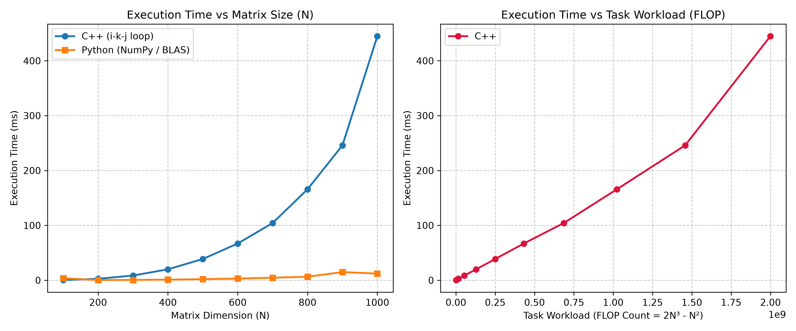

# Автоматизированный бенчмаркинг перемножения матриц (C++ / Python)

Проект предназначен для вычисления произведения двух квадратных матриц на языке C++, автоматической верификации результатов с помощью Python (NumPy), а также для анализа производительности алгоритма в зависимости от размерности задачи и объема операций (FLOP).

## 📌 Основные возможности

* **Вычисления на C++**: Реализация алгоритма умножения матриц с оптимизированным порядком циклов (`i-k-j`) для эффективной работы с процессорным кэшем.
* **Автоматическая верификация**: Сверка результирующей матрицы с эталоном NumPy (`numpy.allclose`) с контролем точности до плавающей запятой.
* **Автоматизация бенчмаркинга**: Python-скрипт запрашивает у пользователя список размерностей, генерирует тестовые наборы данных, запускает C++ модуль и рассчитывает объем операций.
* **Структурирование результатов**: Автоматическое сохранение результатов в подпапки `benchmark_results/run_N<size>/`.
* **Визуализация**: Построение и экспорт графиков производительности (время vs размерность, время vs FLOP).

---

## 🛠 Требования к окружению

* **Компилятор C++**: `g++` с поддержкой стандарта C++17.
* **Python**: Версия 3.8 или выше.
* **Зависимости Python**:
  ```bash
  pip install numpy matplotlib

## Небольшие примечания 
В репозитории проекта представлена папка run_N100, содержащая ряд текстовых файлов - матриц. Данная папка приведена в качестве примера и иллюстрирует какой может быть сгенерированная матрица 

## 📊 Результаты бенчмаркинга и анализ
Ниже представлен график зависимости времени выполнения операции от размерности матриц $N \times N$ и общего объема вычислительной нагрузки:



## 🔍 Выводы по результатам бенчмаркинга

1. Характер зависимости времени от $N$ (Слева):
   * Время выполнения алгоритма на C++ демонстрирует явную кубическую зависимость $\mathcal{O}(N^3)$, что полностью соответствует теоретической сложности трех вложенных циклов.
   * При $N \le 400$ время выполнения C++ остается в пределах нескольких десятков миллисекунд, однако при $N = 1000$ достигает порядка $\approx 440$ ms.
   * Библиотека NumPy показывает кардинально более высокую скорость на больших размерностях (время работы порядка единиц миллисекунд при $N = 1000$). Это обусловлено использованием высокооптимизированных векторных BLAS/LAPACK библиотек (OpenBLAS/MKL), применяющих SIMD-инструкции и многопоточность.
2. Зависимость от вычислительной нагрузки FLOP (Справа):
   * Объем вычислительной работы рассчитывается по формуле $\text{FLOP} = 2N^3 - N^2$.
   * Для $N = 1000$ объем операций превышает $2 \times 10^9$ FLOP (2 GFLOP). График демонстрирует практически линейную связь между объемом операций FLOP и затраченным временем выполнения C++ кода при больших размерах задачи.
